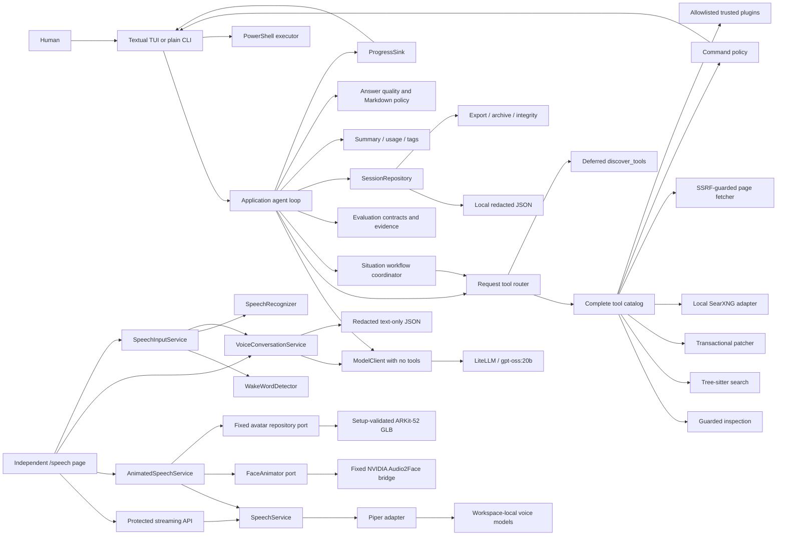

# Architecture

For a file-by-file repository orientation and end-to-end reading path, see
[Project Structure](PROJECT_STRUCTURE.md).

Model selection is presentation-neutral configuration. The composition root validates a session's
saved alias against `HARNESS_MODELS` and creates the OpenAI-compatible adapter for that alias.
Interfaces change the persisted model only while idle; domain and application code remain
independent of LiteLLM.

Local speech follows the same inward dependency rule. Provider-neutral speech values live in the
domain, `SpeechService` depends on the `SpeechSynthesizer` application port, and only
`bootstrap.py` creates the in-process Piper adapter. The browser boundary streams bounded PCM; it
does not expose model paths or make Piper available to domain/application code.

Optional Audio2Face animation preserves that direction. `AnimatedSpeechService` consumes the
existing redacted Piper output through `SpeechService` and a provider-neutral `FaceAnimator` port.
Only `bootstrap.py` creates the fixed-process NVIDIA adapter and validated-avatar catalog
repository. The application sees exact safe avatar IDs and provider-neutral assets, while legacy
single-avatar installs remain the default.
The native SDK, CUDA, TensorRT, GLB parsing, temporary WAV/binary handling, and process APIs remain
in infrastructure/native code and never enter the domain or application layers. The browser maps
the returned 52 named controls to the same-origin GLB with Three.js; the SVG path remains a
backward-compatible fallback.

Protected voice conversations use a separate `VoiceConversationService` and repository port. Each
turn sends only its fixed system instruction, newest bounded redacted transcript, and current
message through `ModelClient` with an empty tool list. This path never constructs `AgentService`, a
tool registry, `ContextBuilder`, project memory, workflows, evaluations, or workspace runtime state.
Schema-v1 text transcripts live below the control workspace's protected `.harness` state; audio
remains browser-memory-only.

Optional microphone input is another independent application boundary. `SpeechInputService`
accepts only bounded 16 kHz mono s16le PCM, coordinates wake detection and transcription ports,
redacts the final transcript, and retains neither audio nor partial recognition. Its sanitized text
enters the existing protected voice-conversation turn; it never calls the model itself.

## Context and trust boundaries

The human controls a synchronous CLI. The harness sends conversation context and tool schemas to a
local LiteLLM gateway, receives tool requests, and mediates all access to the filesystem and
PowerShell. Model output is untrusted input. The launch workspace is trusted project data;
credentials, model responses, and command output remain sensitive.

Evaluation is an application-layer projection over session messages, workflow runs, progress
events, completion evidence, usage, and answer-quality outcomes. It depends on the
`EvaluationRepository` port. The SQLite adapter stores version-1 evidence below each workspace's
`.harness/evaluations`; it does not alter schema-v7 session JSON. Candidate generation uses the
existing model port only when explicitly requested and cannot invoke patches or Git mutation.

## Components and dependency direction

- `domain` owns provider-neutral messages, calls, results, approvals, sessions, and errors.
- `application` owns the bounded agent use case and ports for external behavior.
- `guardrails` owns pure or narrowly stateful policies reusable by adapters.
- `infrastructure` implements OpenAI, filesystem, PowerShell, JSON, SearXNG, and web-fetch boundaries.
- `interfaces` implements terminal input/output and explicit human approval.
- `bootstrap.py` is the sole composition root.

Dependencies point inward. Architecture fitness tests reject outward imports from domain and
application packages.

The composition root injects presentation implementations for `ApprovalGateway`,
`PatchApprovalGateway`, `SessionMaintenanceGateway`, and `ProgressSink`. Interactive supported terminals use a Textual bridge; redirected and limited
terminals use console adapters. The synchronous agent runs in one exclusive worker, and the bridge
marshals updates back to Textual's UI thread. No UI framework crosses the application boundary.

## Runtime flow

The CLI appends a user message and persists it. The agent calls the model with a non-persisted system
prompt and a `ContextBuilder` view of persisted history. It counts prompts, schemas, and messages;
preserves the current protocol; compacts old tool results; and evicts old requests until the budget
fits. Persistence is never rewritten. A final response returns to the CLI. Tool calls are decoded and routed
one at a time; results are appended and sent on the next model turn. The loop stops at a final answer
or the configured turn bound. Around each model and tool operation, the agent records a versioned
`ProgressEvent` and publishes it through `ProgressSink`. Model-authored summaries travel inside the
existing tool arguments or final response marker, so observability adds no model request.

Each submitted request receives a session-local `request_number` applied to its messages and
progress events. The TUI uses it to place a collapsed observable-work timeline between the matching
user prompt and final answer. Model start/completion events merge into one displayed step. The
provider adapter deliberately omits this local presentation metadata from its wire format.

Before a final response is persisted, the pure `AnswerQualityPolicy` normalizes display-safe
Markdown and checks substantive content, fenced blocks, raw HTML, and exact web-source provenance.
One corrective model call may run within the existing request limit. A failed correction preserves
the original substantive response and emits a warning event. `RequestTimelineBuilder` is the shared
projection used by Textual and React; persisted technical events remain complete and unmerged.

Before routing, the deterministic workflow selector chooses one of 20 built-in playbooks or the
general fallback. `WorkflowCoordinator` constrains each stage's schemas, advances from actual tool
outcomes, synchronizes the visible plan, and supplies unmet requirements to final-answer evidence.
It consumes no model call and cannot weaken approval or guardrail boundaries.

In TUI mode, model/tool work runs off the UI thread. Progress is delivered through thread-safe app
calls. Approval blocks only that worker while the UI displays a default-reject modal. Input is
disabled until the request completes, preserving the v1 single-request execution model.

## Extension points

New providers implement `ModelClient`; new storage implements `SessionRepository`; new commands
implement `Tool`. Side-effecting tools must use an approval port. Add concrete implementations only
to the composition root and document changed trust boundaries.

Presentation adapters may be added through the composition factory. Slash-command parsing is a pure
shared interface component so full-screen and plain modes use the same command vocabulary.

Session export, archive, integrity, and quarantine adapters remain behind application ports.
Prompt sanitization occurs before UI display, persistence, and provider submission. Installed
`local_harness.tools` entry points are discovered without import; only configured names are loaded.
Their adapter bounds and redacts results, but an enabled plugin remains trusted in-process code.

The v2 adapters provide project detection, Tree-sitter syntax search, batch reads, transactional
patches, and detected checks. Parsed trees are cached in memory per active session; grammar artifacts
live under protected `.harness/cache/tree-sitter`.

The complete catalog stays registered, while `RequestToolRouter` exposes only a bounded initial
profile. Deferred discovery activates tools for that request but cannot change security policy.
Read-only Git uses argument arrays without a shell; code intelligence layers configured server
availability over Tree-sitter fallback. Schema-v6 task plans and completion evidence remain
provider-neutral domain records.

Web research crosses `WebSearchProvider` and `WebPageFetcher` ports. The SearXNG adapter alone may
call the configured loopback endpoint. External pages pass through public-URL, DNS, redirect,
robots, MIME, timeout, and size boundaries before Trafilatura extracts text locally. Search and page
caches are memory-only, bounded, expire after 15 minutes, and clear on session switch.

SearXNG is exposed only on `127.0.0.1:8080`. This is a local privacy boundary, not offline
operation: upstream engines receive searches and source websites receive page requests.

## Browser presentation boundary

The primary UI is a React SPA served by FastAPI on the Windows host. Each confirmed workspace owns
an isolated runtime, path policy, repository, caches, and task slot; a shared FIFO semaphore admits
two tasks globally. REST provides snapshots/mutations and a bounded version-1 WebSocket delivers
redacted progress and owner-bound approvals. Host, Origin, SameSite cookie, CSRF, and CSP checks
form the localhost browser boundary. No browser framework enters domain or application modules.
React rendering skips raw HTML, restricts links to HTTP(S), and uses semantic light/dark design
tokens. Plain redirected output remains control-sequence-free; compatible interactive terminals
use Rich Markdown, while Textual uses its own accessible light/dark themes.

## Workspace project-memory boundary

Each workspace owns a version-1 SQLite cache below `.harness/cache/project-memory`. The application
depends on `EmbeddingProvider`, `ProjectIndexRepository`, and `ProjectMemoryRetriever`; SQLite and
Ollama remain infrastructure adapters. Safe deterministic parsing supplies files, symbols,
dependencies, architecture, and Git deltas. Ollama is contacted only over loopback for batched
embeddings. Retrieval context is ephemeral, redacted, and budgeted before prior conversation turns.
Embedding failure selects lexical retrieval and never blocks the agent.
Configurable voice agents add a provider-neutral revisioned profile and immutable conversation
snapshot. The application service validates exact workspace/model/tool identities and bounds; the
JSON adapter persists redacted atomic profile documents. `bootstrap.py` alone projects snapshots
into the existing agent runtime, filters the tool registry before request routing, and conditionally
enables project context and workflows. The browser coordinator owns cancellable asynchronous turns
and the existing approval bridge. Protected Voice Chat does not cross this agent boundary.
