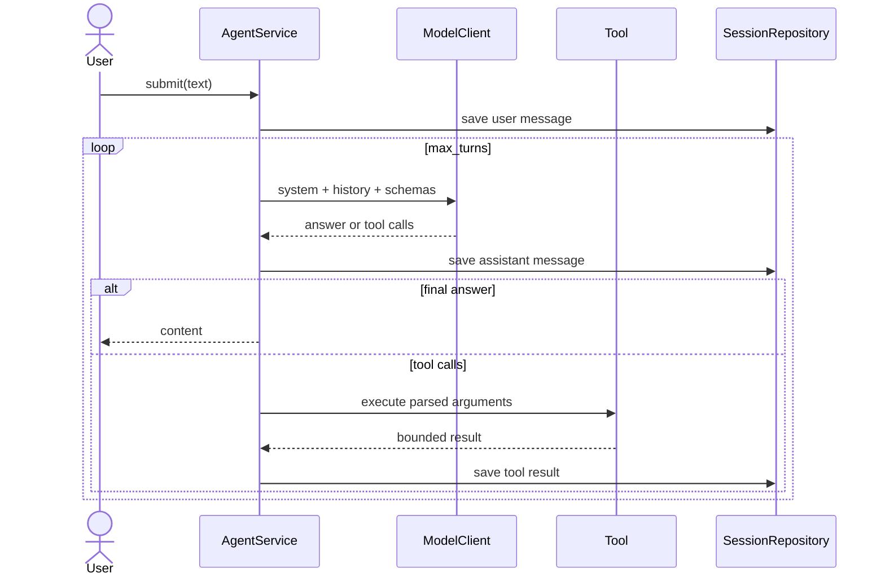

# Low-Level Design

## Browser presentation system

`web/src/ui.tsx` owns presentation-only shell primitives and preference behavior. Theme and density
are stored under `harness-theme` and `harness-density`; panel state uses separate page-specific keys.
`design-system.css` is loaded after legacy page rules and supplies semantic spacing, focus, surface,
status, responsive, and reduced-motion behavior. It contains no API or domain logic.

The top-level route selector remains dependency-free and supports direct navigation. At desktop
widths Chat uses collapsible left/right panels, Voice Conversation uses conversation/content/settings
regions, and Voice Agents uses master-detail editing. Below the documented breakpoints, secondary
regions stack or become existing drawers while primary content remains scrollable. Dialogs close on
Escape, restore an explicit control where applicable, and mutations retain their existing protected
API paths.

## Streaming speech boundary

`domain/speech.py` defines immutable voice, request, PCM-format, and stream values.
`application/ports.py` owns `SpeechSynthesizer`; `application/speech.py` validates bounds and applies
`SecretRedactor` before provider submission. `infrastructure/piper_speech.py` loads only fixed model
names below `.harness/models/piper`, maps rate to Piper `length_scale`, and wraps the provider
iterator in an explicitly closeable global reservation.

`POST /api/v1/speech/stream` uses the existing cookie, exact-Origin, CSRF, body-size, and trusted-host
controls. A one-item `asyncio.to_thread` pull bridge keeps Piper work off the event loop and closes
the iterator on disconnect. Fixed response headers describe s16le mono PCM and redaction without
echoing text. `/speech` consumes the `ReadableStream` with Web Audio; no server audio file exists.

## Model-only voice conversations

`VoiceConversationService` accepts a mapping of exact configured model aliases and a
`VoiceConversationRepository`. Create, update, delete, and generation contend on one non-blocking
gate so a model cannot change mid-turn and calls cannot queue. A turn sanitizes its input, selects
newest whole messages within `HARNESS_CONTEXT_MAX_CHARS`, and calls `ModelClient.complete` exactly
once with `tools=()`. Tool-call output, empty answers, and provider failures do not persist a partial
turn. Successful user/assistant pairs are written atomically to schema-v1 JSON below
`.harness/voice-conversations`.

Transcript reads require an issued browser cookie; mutations additionally require exact Origin and
CSRF. Detail reads are paginated to 100 messages. API serialization derives non-persisted
`speech_text` from normalized Markdown. The React client then uses the existing protected PCM
endpoint, so a TTS failure cannot discard the saved answer.

`SpeechInputService` owns a separate non-blocking global microphone reservation and composes only
provider-neutral wake-stream and transcription ports. Browser audio is fixed at 16 kHz mono s16le;
frames, byte rate, pre-roll, start timeout, silence, and total duration are bounded. A protected
WebSocket validates browser cookie and Origin, then requires CSRF plus a closed start frame before
binary audio. Only sanitized final transcripts return. Sherpa-ONNX and Faster Whisper remain
infrastructure adapters composed in `bootstrap.py`.

## Session model selection

`Settings.models` is the ordered validated alias allowlist; `Settings.model` is its required default
member. `Runtime.model_client_for()` resolves an exact alias and `Runtime.switch_model()` persists
`Session.model` before rebinding the agent. CLI, Textual, and the browser model endpoint share this
operation. Schema 7 is unchanged because sessions already persist `model`.

## Evaluation records

`EvaluationContract` declares required workflow/tool/evidence and configured limits.
`EvaluationObservation` links a deterministic `EvaluationScore` to session/request identity and
redacted event references. `EvaluationRun` freezes a suite/model/component fingerprint;
`CandidateComparison` applies paired thresholds. `HandoffSnapshot` carries bounded completed,
remaining, failed, changed-file, and check facts. `HarnessCandidate` targets allowlisted
`ComponentSnapshot` IDs and has proposed/approved/rejected review state.

`EvaluationRepository` is the application port. `SqliteEvaluationRepository` stores version-1
records transactionally with WAL mode, a workspace marker, bounded redacted payloads, and corruption
quarantine. Session schema remains version 7.

## Presentation types

- `select_ui_mode(requested, stdin, stdout, environment)` deterministically resolves `tui` or
  `plain` without side effects.
- `parse_command(value)` returns a typed command, ordinary prompt, or syntax error shared by both
  interfaces.
- `HarnessApp` owns widgets, keyboard routing, responsive layout, and one exclusive agent worker.
- `RequestActivity` is a collapsed-by-default, request-scoped timeline. It merges model start and
  completion by call number and retains distinct tool steps by event sequence.
- `TuiBridge` implements approval, maintenance-confirmation, and progress ports; it redacts before
  posting to the UI thread and defaults pending approvals to rejection.
- `ApprovalScreen`, `MaintenanceApprovalScreen`, session/event screens, and help own focused modal
  workflows. Event filtering matches kind, state, free text, and tags.

The visible transcript selects the latest 100 persisted user/assistant messages with non-empty
content. Wide terminals reserve 34 columns for a scrollable, complete active-session activity log;
resize events add a `narrow` class below 100 columns and hide that panel. The TUI event overlay shows
the complete active session unless `/events <count>` explicitly selects the latest entries.

`Ctrl+Enter` sends while Enter remains a newline. The composer becomes disabled before dispatch and
is restored after success or translated failure. Session-changing actions are refused while busy.

## Core contracts

`ModelClient.complete(messages, tools)` returns `ModelCompletion` with an assistant message and
optional `TokenUsage`; missing usage receives a labelled character-based estimate. `Tool.execute(arguments)`
returns a `ToolResult`. `ApprovalGateway.request(...)` returns an immutable `ApprovalDecision`.
`PatchApprovalGateway.request_patch(...)` authorizes one exact diff.
`CommandExecutor.execute(command)` returns a structured `CommandExecution`. `SessionRepository`
saves, loads, and lists `Session` entities. `ProgressSink.publish(event)` renders an observable
lifecycle event without introducing UI dependencies into the agent.
`WebSearchProvider.search(request)` returns normalized sources and warnings. `WebPageFetcher.fetch`
returns one extracted page after network policy enforcement.

`AnswerQualityPolicy.assess(content, messages, request_number)` returns an immutable
`AnswerQualityAssessment` with bounded observable issues and the exact allowed source URLs.
`normalize_assistant_markdown` normalizes line endings, exact ` ` tags outside code, and excessive
blank lines without rewriting wording or code. `build_request_timeline` creates the shared inline
projection by pairing a model tool request with matching tool completion/error events; it never
changes the persisted audit.

Tool schemas use JSON objects with no additional properties. Invalid JSON, non-object arguments, and
unknown tool names become tool errors rather than process failures. A placeholder name such as `?`
is repaired only when the supplied argument names satisfy exactly one registered closed schema;
ambiguous or meaningful unknown names remain errors. Empty final model responses are recorded as
model errors and retried with one ephemeral correction instruction within the existing call limit.
Substantive finals with invalid Markdown, raw HTML, or incomplete citation provenance receive at
most one equivalent correction call. Only the selected response is persisted. Exhaustion or another
invalid response retains the normalized original with a warning event.

`RequestToolRouter` selects a `coding`, `web`, `system`, or `general` profile from sanitized input
and exposes at most `HARNESS_TOOL_SCHEMA_LIMIT` schemas. `discover_tools` activates up to
`HARNESS_TOOL_ACTIVATION_LIMIT` matching tools for later calls. Inactive tools are rejected, and a
stable name-plus-arguments signature blocks the third identical failed call. Only configured aliases
are repaired.

`git_inspect` uses fixed read-only Git argument arrays. `code_intelligence` offers definition,
reference, hover, symbols, and diagnostic availability with Tree-sitter navigation fallback.
`task_plan` enforces bounded steps, one in-progress step, and verification before completion.

Before model submission, the application copies each tool schema and adds a required
`step_summary` string. The agent bounds and records this summary, then removes it before invoking the
tool. Final responses begin with `<step_summary>...</step_summary>`; the marker is stripped from the
normal assistant message. Missing or malformed summaries use deterministic fallbacks.

## Agent state sequence

## Tool behavior and limits

- Listing is non-recursive, sorted, protected-path filtered, and capped at 200 entries.
- Reading accepts inclusive one-based lines, reads UTF-8 only, rejects NUL bytes, and caps a request
  to 1,000 lines plus the configured character limit.
- Search is literal and case-insensitive, uses a filename glob, skips protected/binary/non-UTF-8
  files, and caps files and matches.
- PowerShell uses `-NoProfile -NonInteractive`, workspace `cwd`, null stdin, a default 120-second
  timeout, merged bounded output, redaction, command policy, and explicit approval.
- `inspect_project` returns languages, frameworks, manifests, entrypoints, a depth-bounded tree,
  detected non-fixing checks, and truncation metadata without executing project code.
- `find_code` uses Tree-sitter for syntactic definitions, imports, and references; unsupported
  grammars fall back to bounded literal search.
- `read_files` accepts at most eight path/range requests and 500 lines per range under one budget.
- `apply_patch` validates at most 20 operations across 10 UTF-8 files, previews a redacted unified
  diff, requires approval, detects races, and atomically commits or rolls back.
- `run_project_checks` accepts only a currently detected profile, applies command policy, requests
  exact approval, and uses the existing bounded executor.

Every v2 result contains `version`, `summary`, `items`, `truncated`, `next_cursor`, and `metadata`.
Configuration defaults are 60,000 context characters, eight batch files, and 100,000 patch chars.

- `web_search` accepts a bounded query, general/news category, language, day/month/year filter,
  result count, and opaque cursor. It deduplicates canonical URLs and ranks by score, engine
  consensus, and original order. Harmless local-model variants (`web`, `search`, empty category,
  unrestricted time aliases, empty initial cursor, and excess positive result counts) normalize to
  canonical values and are recorded in envelope metadata; unrelated values remain errors.
- `read_web_pages` accepts one to five URLs and retains per-page success/error records. Downloads
  cap at 2 MB, extraction at 12,000 characters per page, and the envelope at 30,000 characters.
- Web results use stable URL-derived source IDs and carry `content_is_untrusted`. Older results keep
  citation identity plus bounded content head/tail during context compaction.

`SafeWebPageFetcher` manually validates three redirects, resolves every hostname, rejects non-global
addresses, permits HTTP(S) ports 80/443, respects robots.txt, streams bounded HTML/XHTML/plain text,
disables environment proxies and cookies, then extracts locally. One 429/502/503/504 response is
retried after a bounded delay; persistent failures remain explicit per-page errors. Web data needs
no dedicated session fields.

## Context selection

`ContextBuilder` counts the serialized system prompt, tool definitions, and selected messages. The
current user request and valid assistant/tool pairs are essential. Older current-request results
compact while the newest remains full. Prior requests contribute only user prompt and final answer,
newest first. Old requests are evicted until the budget fits; oversized essential context raises
`ContextLimitError` without mutating session history.

## Session schema

Schema version 7 stores session ID, workspace, model, timestamps, messages, events, call-limit and
advisory-token-budget overrides, plus a bounded deterministic or explicit-LLM summary. Events add
normalized tags, input/output tokens, and provider/estimated/unknown usage source. Versions 1-4
load with safe defaults; versions 1-5 load empty plans and evidence. Versions 1-6 load empty
workflow history and are written as v7. Plans
contain observable steps. Completion evidence records changed files, checks, sources, and limits.
Workflow runs record definition version, selection source/confidence, stage attempts/results,
status, and a one-shot pending override. The workflow run owns its task-plan projection.
Messages store role, content, optional tool calls, call ID, tool name, and request number. Files use a UUID-derived
32-character hexadecimal name and are written to a temporary sibling before atomic replacement.

Progress events store sequence, request number, call number, kind, summary, target, status,
duration, timestamp, tags, and usage. The TUI groups request events beside their
prompt; the sidebar retains the complete technical sequence. Legacy untagged events remain available
in the sidebar and event viewer. Plain mode resumes with five events and `/events` defaults to 20.

Automatic summaries derive from recent final outcomes without another call. `/summarize` uses one
explicit tool-free call over a bounded 20,000-character transcript and retains the old summary on
failure. Advisory quota warnings persist once at the configured threshold and once at 100%.

Exports are unique Markdown or CSV files containing the re-redacted full record. Archives contain
only `session.json`, with a SHA-256 sidecar manifest; restore rejects extra entries, checksum or
workspace mismatch, invalid schema, and destination collision. Integrity IDs bind filename, size,
mtime, and reason so changed files cannot be quarantined from stale results.

Plugin factories in `local_harness.tools` receive `PluginContext` version 1. Startup validates tool
names, uniqueness, closed schemas, descriptions, and a 32-tool total limit. Only names in
`HARNESS_ENABLED_PLUGINS` are imported; enabled failures stop startup clearly.

## LLM-call limit resolution

The default is 20 calls per user request and valid values are 1–100. One assistant completion counts
as one call even if it requests multiple tools. Precedence is explicit `--max-turns`, saved session
override, `HARNESS_MAX_TURNS` from process/`.env`, then the default. CLI overrides are saved. The
runtime `/max-turns N` command updates the current session before its next request, while
`/max-turns reset` clears persistence and restores the startup baseline.

## Error taxonomy

`ConfigurationError`, `PolicyViolation`, `ToolExecutionError`, `SessionError`, and `ModelError` derive
from `HarnessError`. Unexpected programming errors are not silently converted into policy decisions.

## Browser protocol

`WebRuntimeCoordinator` lazily composes workspace runtimes with shared control-root settings.
`WebPresentationBridge` forwards synchronous ports to `WebEventHub`. Version-1 envelopes contain
event, workspace, session, task, request, timestamp, type, and redacted payload fields. The hub
retains 500 events and caps client queues at 200; overflow requires snapshot resynchronization.
Approvals belong to the request-origin client, expire after ten minutes, and reject on disconnect,
task end, or shutdown. The atomic catalog is schema version 1; session JSON is version 7.

## Project-memory index

`ProjectIndexStatus`, `IndexedFile`, `IndexedSymbol`, `DependencyFact`, `IndexDelta`,
`ProjectMemoryQuery`, `ProjectMemoryHit`, and `RetrievedProjectContext` are provider-neutral domain
records. SQLite schema version 1 contains `meta`, `files`, `symbols`, `dependencies`, `chunks`, and
`delta`. Content hashes bind symbol IDs and reject stale `read_symbol` calls. Vector blobs are
float32 and configuration/model/dimension mismatches invalidate or re-embed cache data.

`ContextBuilder.build(..., project_context=...)` places a redacted ephemeral system message after
the harness instruction. Memory shrinks first; the current prompt and current valid tool protocol
are never silently truncated. `memory_retrieval` and `index_update` events report generation, mode,
selected paths, injected/avoided characters, duration, and fallback without source content.
## Configurable voice-agent profiles

`domain/voice_agent.py` defines profile specs, immutable snapshots, and the runtime execution policy.
`VoiceAgentProfileService` sanitizes instructions and validates exact dynamic workspace/tool
catalogs plus model, voice, context, answer, routing, call, token, workflow, and rate bounds.
`JsonVoiceAgentProfileRepository` uses schema-v1 atomic JSON files under the control workspace.

Agent conversations use schema-v2 voice-conversation metadata and reference a normal workspace
session for their transcript. `/agent-turns` submits that session to `WebRuntimeCoordinator` with
the snapshot policy. `Runtime.agent` filters `ToolRegistry` before constructing
`RequestToolRouter`, optionally omits project memory, applies snapshot limits, and checks a
cooperative cancellation signal before model and tool boundaries. The browser event stream carries
progress, approvals, cancellation, failure, and the final redacted response.
