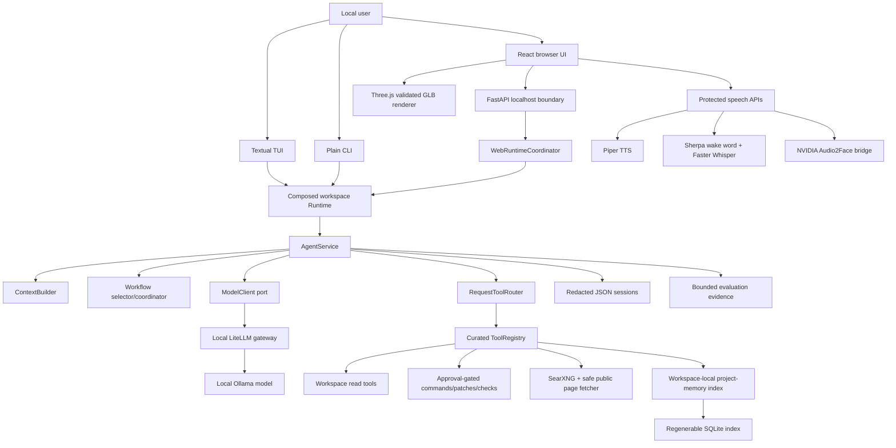

# Project Structure

This document is the fastest complete orientation to the Local AI Harness repository. It explains
what runs, where each responsibility lives, how a request travels through the system, what is
persisted, which security boundaries must remain intact, and where to make common changes.

It describes the `main` branch. Branch-specific experiments are intentionally not presented as
shipped functionality.

## 1. System at a glance

The repository contains one local AI product with three supported presentation surfaces and several
optional local media capabilities:

- A React browser application served at `http://127.0.0.1:3000`.
- A Textual full-screen terminal interface.
- A plain command-line interface for redirected or minimal terminals.
- A workspace-bounded agent loop using exact configured LiteLLM model aliases.
- Curated inspection, coding, Git, web-research, planning, and project-memory tools.
- Explicit approval boundaries for PowerShell, patches, and project checks.
- A separate speech experience with Piper TTS, protected voice conversations, local wake-word/STT,
  configurable voice-agent profiles, and optional NVIDIA Audio2Face animation.

The browser currently routes these modules:

| Route | Purpose | Backend path |
| --- | --- | --- |
| `/` | Workspace chat and agent activity | Full bounded agent runtime |
| `/speech` | Voice Conversation and Direct TTS | Protected one-call chat, speech, STT, Audio2Face |
| `/speech/agents` | Voice-agent profile configuration | Profile snapshots over the normal agent runtime |
| `/studio` | Studio availability page on `main` | Full Studio implementation remains branch-specific |

The most important architectural rule is:

```text
domain <- application <- infrastructure/interfaces
                         ^
                         |
                    bootstrap.py
```

Dependencies point inward. Domain objects know nothing about FastAPI, React, OpenAI, files,
processes, Piper, NVIDIA, or databases. Application services depend on protocols declared in
`application/ports.py`. Infrastructure and interfaces implement those protocols. Only
`bootstrap.py` chooses and wires concrete implementations.

## 2. End-to-end runtime map



### Chat request lifecycle

1. An interface sanitizes the user prompt with `SecretRedactor` before display, persistence, or
   provider submission.
2. The selected workspace runtime loads the saved session and exact model alias.
3. `ContextBuilder` creates a bounded provider view without rewriting the full saved transcript.
4. Automatic project-memory retrieval may add one bounded, ephemeral workspace context block.
5. The deterministic workflow selector chooses one of 20 built-in workflows or the fallback.
6. `RequestToolRouter` exposes a small initial schema set. `discover_tools` may activate additional
   registered tools for only that request.
7. `AgentService` calls the model and handles tool requests one at a time within configured limits.
8. Every tool remains subject to its path, command, network, approval, and output policies.
9. Progress events, plans, workflow evidence, token usage, and messages retain a request number and
   are persisted in the session.
10. The final answer passes through Markdown normalization, evidence consistency, and
    `AnswerQualityPolicy` before persistence and display.

### Protected voice-conversation lifecycle

Voice Conversation is intentionally different from the full agent:

1. The sanitized user message and newest bounded conversation history are loaded.
2. Exactly one selected model client is called with a fixed prompt and an empty tool list.
3. The bounded Markdown answer is persisted as redacted text.
4. Piper generates speech; optional Audio2Face animation is generated from the same PCM.
5. Audio and animation remain current-utterance browser memory and are not stored as history.

Voice-agent profiles are the explicit route back into the full agent runtime. A profile snapshots
one workspace, one model, an exact tool allowlist, limits, context/workflow settings, and voice
preferences. Profile instructions cannot weaken code-enforced guardrails.

## 3. Repository root

```text
.
|-- AGENTS.md                 Coding-agent rules and non-negotiable boundaries
|-- CONTRIBUTING.md           Contributor workflow
|-- README.md                 User setup and feature overview
|-- pyproject.toml            Python package, dependencies, entry points, and quality config
|-- .env.example              Safe configuration template; real .env is ignored
|-- .github/workflows/        CI quality workflow
|-- docs/                     Design, security, workflows, use cases, and ADRs
|-- local-ai/                 Docker/local service controller and gateway configuration
|-- native/                   Native Audio2Face bridge source
|-- scripts/                  Setup, conversion, startup, formatting, and checks
|-- src/local_harness/        Python product code
|-- tests/                    Offline Python tests and architecture fitness tests
|-- web/                      React/TypeScript browser application
`-- Start All Services.cmd    Double-click Windows launcher
```

Generated dependencies, local models, runtime state, browser builds, and credentials do not belong
in Git. The important ignored locations are `.env`, `.venv`, `.harness`, `local-ai/runtime`,
`web/node_modules`, `web/dist`, test/coverage caches, and the independent Audio2Face SDK checkout.

## 4. Python package map

### `src/local_harness/domain`

The domain package contains provider-neutral records, invariants, and exception types. It must not
import application, infrastructure, interfaces, UI frameworks, provider SDKs, or process APIs.

| Module | Responsibility |
| --- | --- |
| `models.py` | Core messages, tool calls/results, sessions, usage, progress, plans, workflow runs, completion evidence, and approvals |
| `errors.py` | Domain-specific error hierarchy translated safely by interfaces |
| `limits.py` | Shared bounded LLM-call validation |
| `maintenance.py` | Export, archive, integrity, and plugin-status records |
| `evaluation.py` | Evaluation contracts, observations, runs, candidates, comparisons, and handoffs |
| `project_memory.py` | Index state, files, symbols, dependency facts, hits, and retrieved context |
| `plugins.py` | Minimal context passed to trusted allowlisted plugins |
| `web.py` | Public-web search requests, sources, responses, and fetched pages |
| `web_ui.py` | Browser workspace, task, and event records without FastAPI types |
| `speech.py` | Voice catalog, bounded speech requests, PCM format, and streams |
| `speech_input.py` | PCM input, recognition results, transcripts, and input events |
| `voice_conversation.py` | Saved protected voice conversations and messages |
| `voice_agent.py` | Revisioned profile specifications, snapshots, and execution policy |
| `audio2face.py` | Facial frames, packed rig animation, avatar catalog/status, and animated speech |

When adding a new capability, begin here only if it needs stable business language or invariants.
Do not add a domain type merely to mirror an HTTP payload.

### `src/local_harness/application`

The application package coordinates use cases. External behavior is represented by protocols in
`ports.py`; concrete adapters never appear here.

| Module | Responsibility |
| --- | --- |
| `ports.py` | Model, tool, approval, persistence, speech, web, embeddings, evaluation, and avatar contracts |
| `agent.py` | Bounded model/tool loop, cancellation boundaries, progress, persistence, and final-answer handling |
| `context.py` | Deterministic provider-context budgeting and old-result compaction |
| `tool_registry.py` | Complete registered tool catalog and exact restriction |
| `tool_routing.py` | Initial profiles, schema limits, deferred discovery, and activation state |
| `workflows.py` | The 20 workflow definitions, selector, stage transitions, and requirements |
| `progress.py` | Observable step summaries and final-summary extraction |
| `timeline.py` | Shared request-number-based activity projection for terminal and browser UIs |
| `task_plans.py` | Deterministic persisted plan operations |
| `evidence.py` | Completion evidence and verification-section consistency |
| `answer_quality.py` | Safe Markdown normalization and citation/evidence validation |
| `session_services.py` | Session metadata, tags, bookmarks, exports, archives, and integrity use cases |
| `evaluation.py` | Deterministic observations, comparison, candidate review, and handoffs |
| `evaluation_cases.py` | Built-in offline evaluation cases |
| `evaluation_components.py` | Stable component fingerprints used by evaluation evidence |
| `speech.py` | Bounded redacted TTS use case |
| `speech_input.py` | Wake/tap state machine, PCM limits, silence handling, and transcript sanitization |
| `voice_conversation.py` | One-call/no-tools saved voice chat and Markdown-to-speech conversion |
| `voice_agent_profiles.py` | Profile validation, revisions, templates, snapshots, and availability |
| `audio2face.py` | Piper-to-face-animation coordination and avatar-specific control filtering |

### `src/local_harness/guardrails`

Guardrails are executable policy, not prompt advice.

- `path_policy.py` resolves workspace-relative paths, blocks protected locations, and prevents
  traversal outside the launch workspace.
- `command_policy.py` evaluates commands before any PowerShell executor is reachable.
- `redaction.py` removes credential-shaped content before display, persistence, and provider input.
- `web_url_policy.py` enforces public HTTP(S), DNS/IP checks, and SSRF boundaries.
- `workspace_catalog_policy.py` validates browser-registered workspace roots and rejects unsafe
  roots, UNC paths, symlink roots, and junctions.

### `src/local_harness/infrastructure`

Infrastructure modules implement external boundaries. They may use files, processes, SQLite,
provider SDKs, parsers, and network clients, but must remain behind application ports.

#### Provider and execution adapters

- `openai_model.py`: translates provider-neutral messages/tools to the OpenAI-compatible API used
  through LiteLLM.
- `powershell.py`: fixed PowerShell execution with time/output limits and redaction.
- `plugins.py`: import-free discovery followed by explicit loading of trusted allowlisted plugins.
- `tool_output.py`: versioned, bounded JSON tool-result envelope.

#### Workspace and coding adapters

- `filesystem.py`: bounded directory listing, file reading, and text search.
- `project_inspection.py`: project detection, batched reads, check-profile detection, and optional
  language-server availability.
- `code_search.py`: Tree-sitter-backed code discovery with bounded fallback behavior.
- `code_intelligence.py`: syntax/LSP-oriented symbol and navigation operations.
- `coding_tools.py`: model-facing inspect, find, batch-read, patch, and check tools.
- `patching.py`: validate-all-first exact patch transactions, approval, race detection, atomic
  writes, and rollback where possible.
- `git_tools.py`: fixed-argument, read-only Git inspection.
- `plan_tool.py`: request-bound task-plan tool.

#### Project memory and evaluation

- `project_index.py`: regenerable SQLite index of safe metadata, symbols, dependencies, excerpts,
  lexical scores, and local embeddings.
- `project_memory_tools.py`: bounded model tools over that index.
- `ollama_embeddings.py`: loopback-only embedding provider with batching and validation.
- `evaluation_store.py`: workspace-local SQLite evaluation evidence.

#### Web research

- `searxng.py`: loopback SearXNG search adapter.
- `web_fetcher.py`: hardened public-page fetch, redirects, robots, MIME, size, timeout, extraction,
  and DNS validation.
- `web_cache.py`: bounded in-memory web cache.
- `web_tools.py`: closed `web_search` and `read_web_pages` schemas and safe envelopes.

#### Persistence and maintenance

- `json_sessions.py`: atomic, redacted, schema-versioned session JSON.
- `session_files.py`: exports, verified archives, restores, integrity scans, and quarantine.
- `workspace_catalog.py`: atomic browser workspace allowlist.
- `voice_conversations.py`: atomic protected voice-chat transcripts.
- `voice_agent_profiles.py`: atomic revisioned voice-agent profiles.

#### Local speech and avatars

- `piper_speech.py`: in-process Piper voice loading, global synthesis bound, and streaming PCM.
- `speech_input.py`: Sherpa-ONNX wake-word and Faster Whisper recognition adapters.
- `audio2face.py`: fixed native bridge process, request-unique temporary files, packed facial data,
  cancellation, validation, and cleanup.
- `audio2face_avatar.py`: validated fixed local GLB catalog, safe manifests, control checks, and
  complexity limits.

### `src/local_harness/interfaces`

Interfaces adapt humans and transports to application services.

#### Shared and command-line interfaces

- `commands.py` is the pure shared slash-command parser.
- `cli.py` selects TUI/plain mode and drives sessions and commands.
- `console.py` provides plain approvals and progress output.
- `markdown.py` renders terminal-safe Markdown.
- `ui_mode.py` selects the terminal presentation mode.
- `eval_cli.py` exposes offline evaluation commands.

#### Textual interface: `interfaces/tui`

- `app.py` owns the full-screen layout and worker lifecycle.
- `bridge.py` marshals worker events to Textual's UI thread.
- `activity.py` renders observable request timelines.
- `screens.py` contains default-reject approval, maintenance, sessions, events, and help dialogs.

#### Browser interface: `interfaces/web`

- `server.py` is the loopback-only `harness-web` entry point and composes optional speech services.
- `api.py` defines FastAPI routes, closed request schemas, cookies, Origin/CSRF enforcement,
  WebSockets, bounded error translation, and SPA fallback.
- `coordinator.py` lazily creates one isolated runtime per registered workspace, enforces one task
  per workspace and two globally, and owns cooperative cancellation.
- `bridge.py` converts application progress/approval ports into owner-bound browser events.
- `events.py` is the bounded browser event hub.

### Composition and configuration

- `bootstrap.py` is the only composition root. `build_runtime` wires the model, registry, tools,
  storage, memory, evaluation, policies, and presentation ports. Separate builders compose Piper,
  STT, protected voice conversation, profiles, and Audio2Face.
- `config.py` loads process environment over workspace `.env`, validates every bound and exact
  allowlist, and rejects unsafe loopback/network settings before adapters are created.
- `identifiers.py` creates bounded opaque identifiers.
- `text.py` contains small shared text behavior that does not justify an external port.
- `__main__.py` launches the normal `harness` CLI entry point.

## 5. Browser application map

The browser is a React/TypeScript SPA in `web`. FastAPI serves the built `web/dist` directory. Route
selection is intentionally small and happens in `web/src/main.tsx`; there is no client-router
dependency.

| File | Responsibility |
| --- | --- |
| `main.tsx` | Direct-route selection and React root |
| `App.tsx` | Main chat workspace, transcript, sessions, activity, approvals, and dialogs |
| `SpeechPage.tsx` | Voice Conversation/Direct TTS tab shell |
| `SpeechApp.tsx` | Direct TTS controls, playback, character selection, and avatar presentation |
| `VoiceConversationPanel.tsx` | Saved protected conversations, model selection, STT, auto-speech, and controls |
| `VoiceAgentsPage.tsx` | Profile list/editor, templates, tool risk, limits, and voice output |
| `StudioUnavailablePage.tsx` | Explicit `main`-branch Studio placeholder |
| `Audio2FaceAvatar.tsx` | Three.js GLB loading, morph binding, presenter framing, lighting, fallback, and disposal |
| `audio2face-animation.ts` | Packed float decoding and named morph-frame application |
| `avatar-framing.ts` | Model-independent presenter camera calculation |
| `avatar-inspection.ts` | Development-only mesh/material/texture/skeleton inspection |
| `avatar-pose.ts` | Alias-aware presenter bones, idle/explain poses, and blending |
| `speech-audio.ts` | Web Audio PCM scheduling, stop/replay, and client-side WAV creation |
| `speech-input-client.ts` | Microphone, AudioWorklet, resampling protocol, and protected WebSocket client |
| `api.ts` | Same-origin typed API client, CSRF/session bootstrap, and safe non-JSON errors |
| `types.ts` | Browser DTOs mirroring bounded API responses |
| `timeline.ts` | Browser version of the shared observable timeline projection |
| `markdown.ts` | Safe display normalization and HTTP(S)-only links |
| `presentation.ts` | Theme and presentation helpers |
| `ui.tsx` | Shared shell, module navigation, dialogs, badges, empty states, and status regions |
| `design-system.css` | Semantic tokens, themes, density, shared components, and focus/status colors |
| `styles.css` | Page-specific layouts and responsive behavior |

`web/public/speech-input-worklet.js` runs in the browser audio thread and converts microphone input
to the fixed PCM protocol. It does not perform recognition or contact an external speech service.

Tests live beside the browser code as `*.test.ts`/`*.test.tsx`. `web/e2e/harness.spec.ts` contains
Playwright route, interaction, accessibility, and responsive checks.

## 6. Local service layer

`local-ai` controls dependencies that run beside the host Python server:

- `compose.yaml` defines LiteLLM, its database, and SearXNG containers.
- `litellm-config.yaml` maps exact local aliases to provider targets.
- `searxng/settings.yml` configures the loopback metasearch service.
- `local-ai.ps1` is the canonical setup/start/stop/restart/status/log controller.
- The `.cmd` files are thin Windows launchers for common actions.

The FastAPI harness deliberately runs on the Windows host so approved PowerShell and filesystem
operations retain Windows workspace semantics. Normal startup does not pull images, download
models, or update tools.

## 7. Setup, native code, and asset scripts

### General scripts

- `scripts/setup.ps1`: create/install the Python and browser development environment.
- `scripts/start-all.ps1`: start or restart all services through the canonical controller and
  verify status.
- `scripts/format.ps1`: apply repository formatting.
- `scripts/check.ps1`: required Python/frontend formatting, lint, type, tests, coverage, and build.
- `scripts/test.ps1`: test-focused developer entry point.

### Speech setup

- `setup-voices.ps1`: explicit license-gated, checksum-verified Piper voice installation.
- `setup-speech-input.ps1`: explicit license-gated local KWS and Whisper model installation.
- `setup-audio2face.ps1`: validate/build/install the pinned NVIDIA bridge and model artifacts.
- `setup-audio2face-avatar.ps1`: validate and install one rights-confirmed ARKit-52 GLB.
- `setup-audio2face-cc3-avatar.ps1`: convert and install a rights-confirmed Character Creator asset.
- `install-audio2face-avatar.py`: protected GLB validation/install helper.
- `convert-audio2face-cc3-fbx.py` and `convert-audio2face-vrm.py`: repository-owned Blender
  conversion paths.
- `compact-glb-morphs.py`: compact bounded GLB morph data without changing application behavior.
- `inspect-character-fbx.py`: bounded asset inspection used during local conversion work.

`native/audio2face_bridge` contains the CMake project and C++ host bridge that invokes NVIDIA's
blendshape executor. Python interacts only with the fixed built executable through the
infrastructure adapter.

## 8. Runtime data and persistence

Runtime state is local and ignored by Git. The following is a conceptual map; actual paths are never
returned to browsers or model tools:

```text
.harness/
|-- sessions/                         Redacted schema-versioned agent sessions
|-- exports/                          Explicit session exports
|-- archives/                         Verified session archives
|-- corrupt/                          Recoverable quarantined findings
|-- evaluations/evaluations.sqlite3   Bounded evaluation evidence
|-- cache/project-memory/index.sqlite3 Regenerable workspace index
|-- cache/tree-sitter/                Parser artifacts/cache
|-- voice-conversations/              Redacted text-only protected voice chats
|-- voice-agent-profiles/             Redacted profile revisions
|-- models/piper/                     Installed local voices
|-- models/speech-input/              Installed KWS/STT models
|-- models/audio2face/                Installed Mark model and validated avatars
|-- tools/audio2face/                 Fixed native bridge and dependencies
`-- runtime/audio2face/               Request-unique temporary inference work
```

Important persistence rules:

- User prompts are sanitized before they become messages.
- Session and profile writes are atomic and schema-versioned.
- Project memory is regenerable and never replaces live-file verification.
- Raw web pages are not durable project knowledge.
- Microphone PCM, Piper PCM, WAV output, facial weights, provider payloads, and temporary
  Audio2Face outputs are not persisted as conversation history.
- Browser workspace registration is validate-then-confirm and never deletes workspace data.

## 9. Tool and workflow architecture

All curated tools are registered independently. Request routing changes visibility, not
registration. Plugins are additive and must not replace core tools.

The shipped core categories are:

- Basic workspace reads: list directory, read file, search text.
- Project orientation: inspect project, batch-read files.
- Code navigation: Tree-sitter find, code intelligence, read-only Git.
- Controlled mutation: transactional patch and freshly detected project checks.
- Command execution: policy-checked, explicitly approved PowerShell.
- Planning: request-bound persisted task plan.
- Web research: local SearXNG search and hardened public-page reading.
- Optional project memory: query memory, read symbol, changed context, dependency context.

Every model-facing schema is closed. Every result is returned in a versioned bounded JSON envelope
and redacted before it can be displayed, saved, or returned to a model.

The 20 workflows are definitions in `application/workflows.py`. A stage restricts which registered
schemas are visible and what evidence is required. It never grants approval or bypasses tool,
network, path, or command policy. Changing a workflow requires selector, transition, evidence,
persistence, CLI/TUI/browser, test, and documentation updates.

## 10. Security boundaries to preserve

Read these before modifying execution code:

1. **Workspace containment:** automatic inspection never exposes `.env`, `.git`, `.harness`,
   credentials, or paths outside the registered launch workspace.
2. **Prompt sanitization:** the sanitized value—not a restored original—is displayed, persisted,
   and submitted to providers.
3. **Approval ownership:** commands, patches, and checks require fresh default-reject approval. In
   the browser, approval is client-owner-bound and rejected on disconnect or shutdown.
4. **Command policy:** no terminal command reaches an executor before policy and approval.
5. **Network separation:** SearXNG is an exact loopback service; public page reading separately
   enforces DNS, redirect, robots, MIME, and size policies.
6. **Browser mutation protection:** mutations require the SameSite session, exact Origin, and CSRF.
7. **Localhost-only server:** `harness-web` rejects non-loopback bind configuration.
8. **Bounded work:** model turns, schemas, activations, reads, output, processes, context, web pages,
   audio, and concurrent tasks are explicitly limited.
9. **No prompt-only security:** prompts explain behavior, but only code enforces authority.
10. **Trusted plugin declaration:** enabled in-process plugins are explicitly allowlisted trusted
    code; discovery itself remains import-free.

The detailed rationale is in `docs/GUARDRAILS.md` and the ADR series.

## 11. Tests and quality gates

Python tests in `tests` mirror product boundaries:

- Architecture and configuration fitness: `test_architecture.py`, `test_config.py`,
  `test_bootstrap.py`.
- Agent/context/routing/workflows/evidence: `test_agent.py`, `test_context.py`,
  `test_tool_layer_v2.py`, `test_tool_intelligence_v3.py`, `test_workflows.py`.
- Guardrails and adapters: filesystem, PowerShell, patches, Git, web URL/fetch/cache, and plugins.
- Persistence and evaluation: sessions, productivity, progress, project memory, and evaluation.
- Presentation: CLI, console, TUI, Markdown, and browser API.
- Speech: Piper, wake/STT, protected conversations, profiles, Audio2Face, avatar validation, and
  GLB compaction.

Automated tests use fakes and stay offline unless marked `live`. The complete required gate is:

```powershell
scripts/check.ps1
```

It checks Python formatting/lint, strict mypy, pytest coverage, frontend Prettier/ESLint,
TypeScript, Vitest coverage, and the production Vite build. A feature is incomplete until code,
tests, docstrings, guardrail review, and documentation agree.

## 12. Where to make common changes

| Goal | Start here | Also review |
| --- | --- | --- |
| Add a domain concept | `domain/<capability>.py` | Limits, errors, serialization tests |
| Add an external boundary | `application/ports.py` | Infrastructure adapter and `bootstrap.py` |
| Add a tool | Independent infrastructure tool module | Registry composition, closed schema, routing, workflows, envelope tests |
| Change agent behavior | `application/agent.py` | Context, workflows, evidence, progress, all interfaces |
| Change context limits | `application/context.py`, `config.py` | Session compatibility and retrieval bounds |
| Add a workflow stage | `application/workflows.py` | Selector, evidence, persistence, all presentations, docs |
| Add persistence | Application repository port + infrastructure adapter | Atomicity, schema migration, redaction, ADR |
| Add a browser endpoint | `interfaces/web/api.py` | Closed schema, session, Origin/CSRF, safe errors, React API types |
| Add a browser page | `web/src/main.tsx` and a focused component | Direct refresh, shared shell, responsive/e2e tests |
| Change shared UI | `web/src/ui.tsx`, `design-system.css` | Contrast, focus, reduced motion, all routes |
| Add a model alias | `.env`/`.env.example` allowlist and LiteLLM config | Exact selection validation and restart |
| Add speech behavior | Domain type + application port/service | Infrastructure adapter, browser lifecycle, no-audio persistence |
| Add a 3D avatar format | Protected setup/conversion scripts | Avatar validator, catalog, Three.js mapping, rights documentation |
| Change a security boundary | Guardrail/application contract | Tests, design docs, and a new ADR |

## 13. Recommended reading order

For a first end-to-end study, use this order:

1. `README.md` for installation and user-facing capabilities.
2. This document for repository navigation and runtime relationships.
3. `AGENTS.md` and `docs/GUARDRAILS.md` for non-negotiable engineering constraints.
4. `src/local_harness/domain/models.py` and `application/ports.py` for the shared language.
5. `bootstrap.py` to see the complete concrete object graph.
6. `application/agent.py`, `context.py`, `tool_routing.py`, and `workflows.py` for the main loop.
7. `infrastructure/tools.py`, `coding_tools.py`, `patching.py`, and `web_tools.py` for capabilities.
8. `interfaces/web/coordinator.py` and `api.py` for browser concurrency/security.
9. `web/src/main.tsx`, `App.tsx`, `SpeechPage.tsx`, and `ui.tsx` for presentation.
10. One vertical feature slice, such as speech:
    `domain/speech.py` -> `application/speech.py` -> `infrastructure/piper_speech.py` ->
    `bootstrap.py` -> `interfaces/web/api.py` -> `web/src/SpeechApp.tsx`.
11. The matching tests, which are executable examples of the intended contracts.
12. Relevant ADRs for the reasons behind constraints that may otherwise look unusually strict.

Following one vertical slice is the best way to understand this repository: values and invariants
begin in the domain, orchestration lives in application services, concrete effects live in
infrastructure, composition happens once, and interfaces present the result without owning policy.
